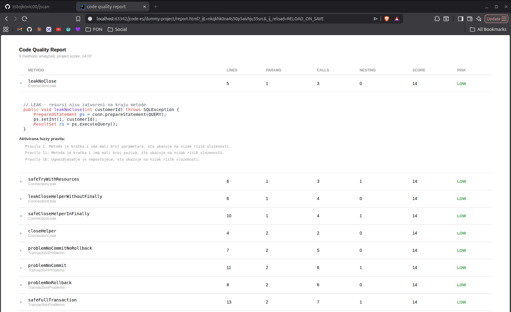

## Static analysis of Java code quality using expert systems.
Faculty project

A tool that analyzes Java source code and detects potential issues using two expert system libraries:

- **Drools** (analyzer module) — rule-based expert system for detecting concrete code defects.
- **jFuzzyLogic** (linter module) — fuzzy logic system for evaluating method complexity and producing a risk level: LOW, MEDIUM, HIGH or CRITICAL.

## Project structure

```
jcode-es/
├── parser/          # Java source parsing (JavaParser), domain model
├── analyzer/        # Drools engine, concrete code defects
├── linter/          # jFuzzyLogic engine, method complexity evaluation
├── html-report/     # HTML report generation (Thymeleaf)
└── dummy-project/   # Sample project used for testing
```

## Usage

```bash
./linter.sh <path-to-java-project>
```

Generates `report.html` in the scanned project folder.

